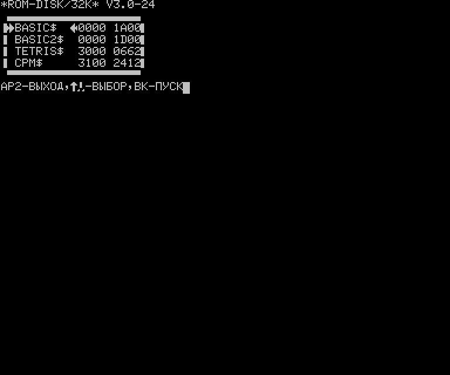

#  Программа управления ROM-диском

## Программа управления

Программа управление ROM-диском ROMCTRL отличается от опубликованной и рассчитана на работу
с ROM-диском, совместимом по формату с Орион-128. ROMCTRL работает на компьютерах Радио-86РК
и Микро-80 с МОНИТОРом, совместимым с Радио-86РК. Загрузка ROMCTRL в память может осуществляться
по любому адресу. Размер программы управления стандартный - 512 байт.

На Микро-80 отображение стрелки вниз в подсказке отображается некорректно, в связи с
тем, что данный символ в стандартном знакогенераторе поврежден. Под Радио-86РК он
отображается корректно.

При вызове директивы "U" (в некоторых версиях МОНИТОРа) или "R7E00,7FFF" и "G" выводится
содержимое ROM-диска.

Выбор программы осуществляется клавишами от "Вверх" и "Вниз". Загрузка осуществляется
по клавише "ВК". Выход из программы управления осуществляется по клавише "АР2" или "Левый-верхний угол".
После загрузки программы производится ее запуск.

## Формат ROM-диска

Формат ROM-диска выбран таким образом, чтобы быть совместимым с Орион-128 и Радио-86РК.
В адресах 0000H-07FFH находится заглушка, препятствующая запуску под Орион, но может
содержать ОRDOS.

Область 0800H-07DFFH содержит файлы в том же формате, что и диск ORDOS.

Каждый файл начинается с заголовка:

  ;0-7 - ИМЯ ФАЙЛА. МОЖЕТ СОДЕРЖАТЬ НЕ БОЛЕЕ 8 СИМВОЛОВ. ЕСЛИ ИМЯ СОДЕРЖИТ МЕНЬШЕ СИМВОЛОВ, СВОБОДНЫЕ ЯЧЕЙКИ ЗАПОЛНЯЮТСЯ ПРОБЕЛАМИ.
  ;8-9 - НАЧАЛЬНЫЙ АДРЕС РАЗМЕЩЕНИЯ ПРОГРАММЫ ПРИ СЧИТЫВАНИИ ЕЕ ИЗ ДИСКА В ОЗУ - АДРЕС "ПОСАДКИ".
  ;А-В - РАЗМЕР ФАЙЛА. В ЭТОТ ПАРАМЕТР ОГЛАВЛЕНИЕ ФАЙЛА(16 БАЙТ) НЕ ВХОДИТ.
  ;С - БАЙТ ФЛАГОВ. В "ORDOS" V2.X ИСПОЛЬЗУЕТСЯ ТОЛЬКО БИТ D7. СОСТОЯНИЕ "1" УКАЗЫВАЕТ НА ТО, ЧТО ФАЙЛ ЗАЩИЩЕН ОТ УНИЧТОЖЕНИЯ. ОСТАЛЬНЫЕ БИТЫ ЗАРЕЗЕРВИРОВАНЫ ДЛЯ РАСШИРЕНИЯ. ИЗМЕНЕНИЕ СОСТОЯНИЯ БИТА D7 ПРОИЗВОДЯТ ВНЕШНИЕ ЗАГРУЖАЕМЫЕ ДИРЕКТИВЫ ОПЕРАЦИОННОЙ СИСТЕМЫ.
  ;D-F - СЛУЖЕБНЫЕ ЯЧЕЙКИ СИСТЕМЫ.

Далее следует сам файл. После окончания файла идет выровненный по границе 
16 байт заголовок следующего файла. Признаком конца файлов является байт 0FFH 
вместо заголовка.

Область 07E00H-07FFFH содержит программу управления ROM-диском по стандарту Радио-86РК.
В случае размера диска больше 32кб, она должны быть оформлена как файл файловой системы ORDOS.

# Схемы диска

ROM-диск может быть выполнен по одной из схем:
- [Радио 1987 год №3](http://archive.radio.ru/web/1987/03/) для Радио-86РК
- [Радио 1987 год №12](http://archive.radio.ru/web/1987/12/) для Радио-86РК
- [Радио 1991 год №10](http://archive.radio.ru/web/1991/10/) для Радио-86РК
- https://github.com/skiselev/radio-86rk-rom для Радио-86РК
- [Радио 1989 год №11](http://archive.radio.ru/web/1989/11/) для Микро-80
